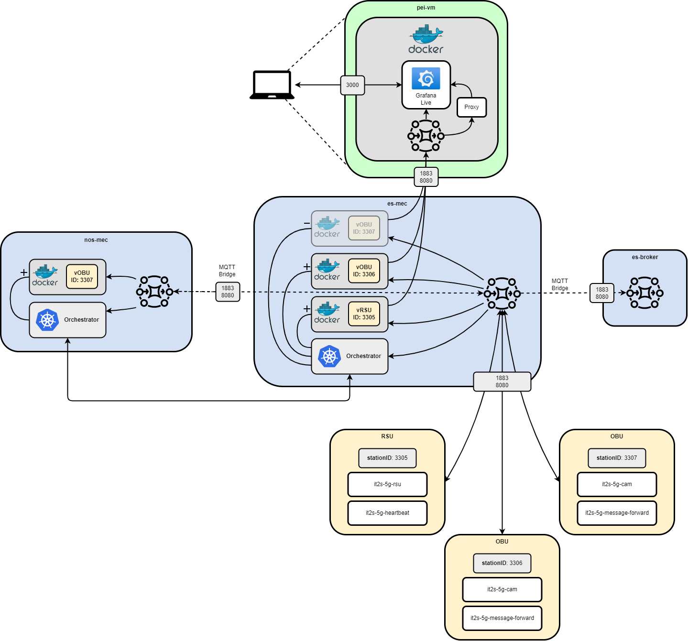
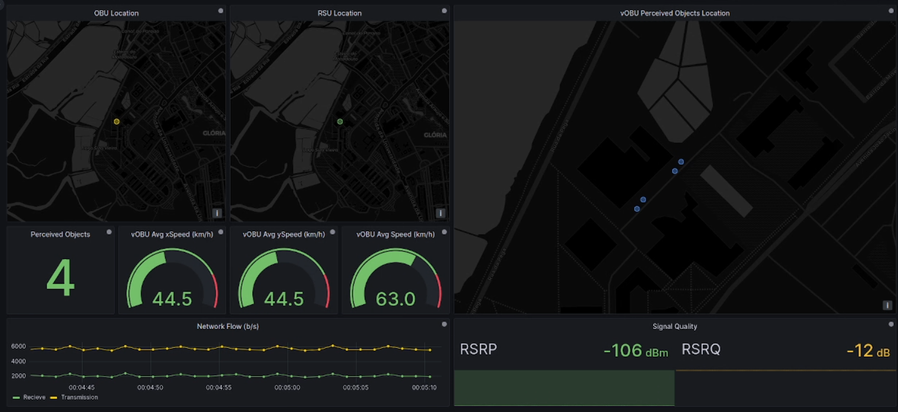
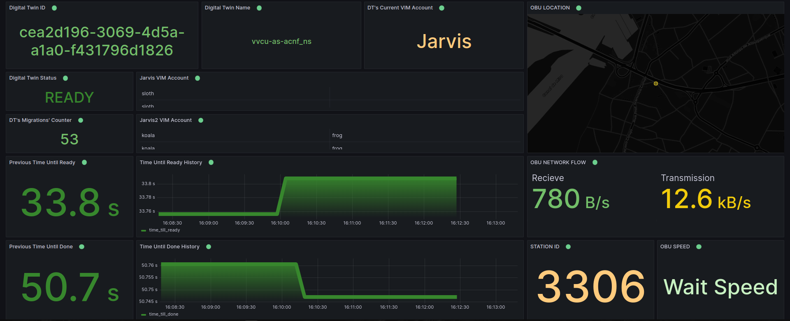

# Grafana Dashboard
This repository provides a docker stack to display info from virtual ITS station digital twins, via MQTT broker.

<br></br>

## Architeture
This stack implements the services contained in green on the following image:



Image 1 - Architeture

<br></br>

## How to Run

1. Run the following command:

    ```bash
    sudo docker compose up --build
    ```

2. The connect to the MQTT Message Broker will be made to our VM **10.255.32.4**.

    1. Note: The absence of authorization during the connecting to the VM will be noticed **if IT-VPN is off**.

3. Go to [localhost:3000](http://localhost:3000/).

4. The dashboard templates are available inside the grafana folder, in this repository.

<br></br>

## Grafana Dashboards



Image 2 - Main Dashboard

<br></br>



Image 3 - Digital Twin Dashboard